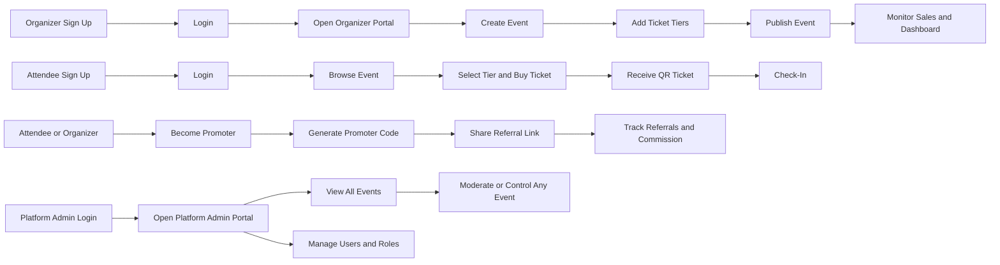
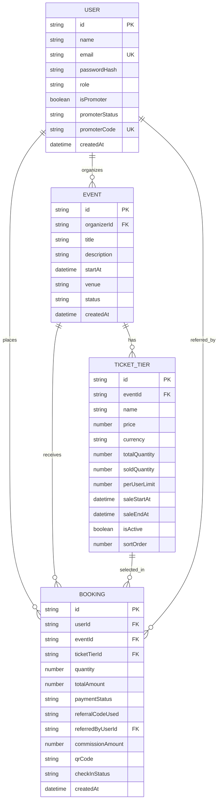

# ConveneHub Auth, Portal, and Access-Control Plan (V2)

## 1. Goal

Implement a simple role architecture where:
- Organizers can create their own accounts.
- The current admin portal is repurposed as the organizer portal.
- A new separate platform admin portal is added.
- Organizers can only create and manage their own events.
- Platform admins can view and control all events across the system.
- Organizers can create multiple ticket tiers per event.

## 2. MVP Scope

### In Scope
- Single authentication system for all user types.
- Self-service organizer registration.
- Organizer-only portal (current admin portal renamed/reused).
- Separate platform admin portal for global control.
- Strict ownership checks so organizers edit only their own events.
- Existing promoter capability retained as profile activation.
- Multi-tier ticketing per event (for example: Early Bird, Regular, VIP).

### Out of Scope (Post MVP)
- Multi-level organization teams with granular custom roles.
- Advanced moderation workflows.
- Enterprise tenant-level permission templates.
- Dynamic/AI ticket pricing.

## 3. Role Model (Recommended)

Keep one user record with one primary role and optional promoter capability.

### User Fields
- role: attendee | organizer | platform_admin
- isPromoter: boolean
- promoterStatus: inactive | active | suspended
- promoterCode: string (unique, nullable)

Notes:
- Replace legacy admin role name with platform_admin for clarity.
- Keep promoter as a flag to avoid extra account types.

## 4. Portal Structure

### 4.1 Organizer Portal (Reuse Current Admin UI)
- Route: /organizer/* (or keep /admin temporarily with redirect)
- Purpose: create, edit, publish, and monitor only own events
- Data scope: records filtered by organizerId = currentUserId

### 4.2 Platform Admin Portal (New)
- Route: /platform-admin/*
- Purpose: global operations, moderation, event oversight, user controls
- Data scope: all events, all organizers, all users

## 5. User Flows

### 5.1 Registration
1. User opens signup page.
2. User selects account type:
   - attendee
   - organizer
3. Backend creates account with selected role.
4. JWT/session is issued.

### 5.2 Login
1. User logs in through one shared login page.
2. Backend returns user profile with role and promoter fields.
3. Frontend routes user:
   - organizer -> organizer portal
   - platform_admin -> platform admin portal
   - attendee -> attendee dashboard

### 5.3 Promoter Activation
1. Logged-in attendee or organizer clicks Become a Promoter in profile.
2. Backend activates promoter status and generates promoterCode.
3. User gets referral link format:
   - /events/{eventId}?ref={promoterCode}

## 6. Authorization Rules

### Organizer Permissions
- Can create events with organizerId = own user id.
- Can read/update/delete only events where organizerId matches own user id.
- Cannot access other organizers' events.

### Platform Admin Permissions
- Can read/update/delete any event.
- Can suspend/unpublish events.
- Can manage users and roles.

### Middleware Requirement
- Add role-based + resource-ownership checks:
  - requireRole([organizer, platform_admin])
  - requireEventOwnershipOrPlatformAdmin

## 7. Data Model Updates

### users collection
- role
- isPromoter
- promoterStatus
- promoterCode

Indexes:
- unique(email)
- unique(promoterCode, sparse)

### events collection
- organizerId (required)
- createdByRole (optional)

Indexes:
- index(organizerId)
- index(status, organizerId)

### orders/bookings collection (existing promoter plan)
- referralCodeUsed
- referredByUserId
- commissionAmount

### ticket_tiers collection (new)
- eventId (required)
- name (required) -> Early Bird, Regular, VIP
- description (optional)
- price (required)
- currency (required)
- totalQuantity (required)
- soldQuantity (default 0)
- perUserLimit (optional)
- saleStartAt (optional)
- saleEndAt (optional)
- isActive (default true)
- sortOrder (default 0)

Indexes:
- index(eventId, isActive)
- unique(eventId, name)

Validation:
- soldQuantity cannot exceed totalQuantity
- price must be >= 0
- saleEndAt must be greater than saleStartAt when both are present

## 8. API Plan

### Auth APIs
- POST /api/auth/register (accept role: attendee | organizer)
- POST /api/auth/login
- GET /api/auth/me

### Organizer APIs
- GET /api/organizer/events
- POST /api/organizer/events
- PATCH /api/organizer/events/{eventId}
- DELETE /api/organizer/events/{eventId}

Each endpoint enforces ownership filtering/checks.

### Organizer Ticket Tier APIs
- POST /api/organizer/events/{eventId}/ticket-tiers
- GET /api/organizer/events/{eventId}/ticket-tiers
- PATCH /api/organizer/events/{eventId}/ticket-tiers/{tierId}
- DELETE /api/organizer/events/{eventId}/ticket-tiers/{tierId}

Rules:
- Organizer can manage tiers only for owned events.
- Block tier deletion if soldQuantity > 0; allow disable instead.

### Platform Admin APIs
- GET /api/platform-admin/events
- PATCH /api/platform-admin/events/{eventId}
- DELETE /api/platform-admin/events/{eventId}
- GET /api/platform-admin/users
- PATCH /api/platform-admin/users/{userId}/role

### Promoter APIs
- POST /api/promoters/activate
- GET /api/promoters/me
- GET /api/promoters/me/referrals

### Public Booking APIs (Tier-Aware)
- GET /api/events/{eventId}/ticket-tiers (active and sale-window valid only)
- POST /api/bookings (accept ticketTierId and quantity)

Booking checks:
- tier belongs to selected event
- tier is active and within sale window
- requested quantity does not exceed remaining inventory
- optional per-user limit is enforced

## 9. Migration Plan from Current Setup

1. Rename current admin UI labels to organizer portal wording.
2. Keep temporary redirect from /admin/* to /organizer/*.
3. Migrate existing admin users:
   - business/organizer operators -> organizer
   - true system operators -> platform_admin
4. Seed at least one platform_admin account through env-safe script.

## 10. Frontend Changes

### Shared Auth
- Signup adds role selection (attendee or organizer).
- Login remains single entry point.

### Organizer Portal (Reused Existing Admin Screens)
- Keep existing event CRUD UI.
- Remove global event/user controls.
- Ensure list pages call organizer-scoped endpoints only.
- Add Ticket Tiers tab inside event create/edit flow.
- Allow create, reorder, activate/deactivate tiers.

### Platform Admin Portal (New)
- Add global event list with status controls.
- Add organizer/user management screens.
- Add audit/monitoring views.
- Add event ticket-tier audit view (read + moderation actions).

## 11. Security and Audit

- Enforce server-side ownership checks on all organizer event mutations.
- Never rely only on frontend filtering for access control.
- Add audit logs for:
  - event updates/deletes
  - role changes
  - status moderation actions
- Add rate limiting on auth and promoter activation endpoints.
- Use atomic inventory update to prevent overselling tier stock.
- Log ticket-tier create/update/delete actions with actorId.

## 12. Testing Plan

### Backend Authorization Tests
- Organizer can update own event.
- Organizer cannot update another organizer event (403).
- Platform admin can update any organizer event.
- Organizer can manage tiers only for own event.
- Organizer cannot manage tiers of another organizer event (403).

### Frontend Route Tests
- Organizer cannot access platform-admin routes.
- Platform admin can access both platform-admin and read organizer views if needed.

### Regression Tests
- Existing attendee booking flow still works.
- Promoter activation and referral attribution still work.
- Tier inventory decreases correctly after paid booking.
- Booking fails when requested tier is sold out.

## 13. Implementation Phases

### Phase 1: Roles and Schema
1. Update role enum to include platform_admin.
2. Add organizerId constraints to events and indexes.
3. Add migration script for legacy admin mapping.

### Phase 2: Backend Guards and Endpoints
1. Add ownership middleware.
2. Build organizer-scoped event endpoints.
3. Build platform admin global endpoints.
4. Add organizer ticket-tier CRUD with ownership checks.
5. Add tier-aware booking validation and inventory update.

### Phase 3: Portal Refactor
1. Repurpose current admin pages for organizer use.
2. Create new platform admin route group and pages.
3. Add route guards by role.
4. Add organizer event ticket-tier management UI.

### Phase 4: QA and Launch
1. Execute auth/ownership test matrix.
2. Verify old admin links redirect correctly.
3. Roll out with monitoring and audit verification.

## 14. Acceptance Criteria

- Organizers can self-register without admin invitation.
- Current admin portal successfully functions as organizer portal.
- Separate platform admin portal exists and has global event control.
- Organizers can edit only their own events.
- Unauthorized organizer edits return 403 consistently.
- Attendee and promoter flows remain operational.
- Organizers can create multiple ticket tiers per event.
- Ticket purchase supports selecting a tier and respects tier inventory.

## 15. Mermaid User Flow Diagram

## 16. Mermaid ER Diagram (Updated)

## 17. Suggested Database Collections

### Users
- _id
- name
- email
- password
- role (organizer/promoter/attendee/admin)

Recommended additions for current plan:
- tenantId
- isPromoter
- promoterStatus
- promoterCode

### Events
- _id
- title
- description
- date
- venue
- organizerId

Recommended additions for current plan:
- tenantId
- status
- capacity
- createdAt

### Tickets
- _id
- eventId
- type (VIP/General)
- price
- quantity

Recommended multi-tier structure:
- Keep one ticket tier record per type (Early Bird, General, VIP)
- Add soldQuantity
- Add perUserLimit
- Add saleStartAt and saleEndAt

### Orders
- _id
- userId
- eventId
- ticketId
- paymentStatus

Recommended additions for current plan:
- quantity
- totalAmount
- referralCodeUsed
- referredByUserId
- commissionAmount
- createdAt

### Attendees
- _id
- eventId
- userId
- qrCode
- checkInStatus

Recommended additions for current plan:
- checkInAt
- checkInBy

### Promoters
- _id
- userId
- eventId
- referralCode
- commission

Recommended additions for current plan:
- status
- totalClicks
- totalConversions

### Analytics
- _id
- eventId
- revenue
- attendance
- promoterPerformance

Recommended additions for current plan:
- organizerId
- tenantId
- checkInRate
- soldByTier
- updatedAt

### Notes on Simplification
- You can keep `Promoters` as a separate collection for reporting convenience, but role source of truth should remain in `Users`.
- For scale and easier queries, `Tickets` should represent ticket tiers and `Orders` should capture each purchase transaction.
- Admin scope should focus on platform-wide monitoring and tenant control, while organizer queries should always be filtered by organizerId.
